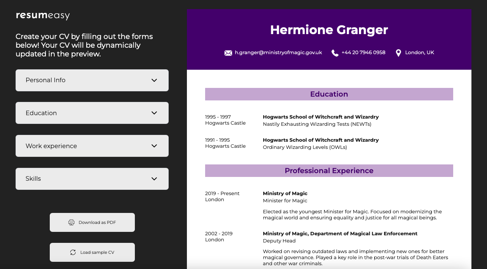

# CV Generator

This project is a small CV application created using React. It's designed to help you practice fundamental concepts in React, such as state and props, by building a practical, real-world application. The CV application allows users to input, edit, and display their personal, educational, and professional information in a structured format.

## Demo

[Live Demo](https://capable-dusk-eda372.netlify.app/)

## Project Screenshots

## Features

Here are some of the key features of the CV Application:

Real-time Visualization: Inputted data is displayed in real-time in the preview section.
Editable Fields: Users can edit their submitted information and see the changes immediately.
Download as PDF: Users can download their CV in a properly formatted PDF file.

## Built With

* React JS
* CSS
